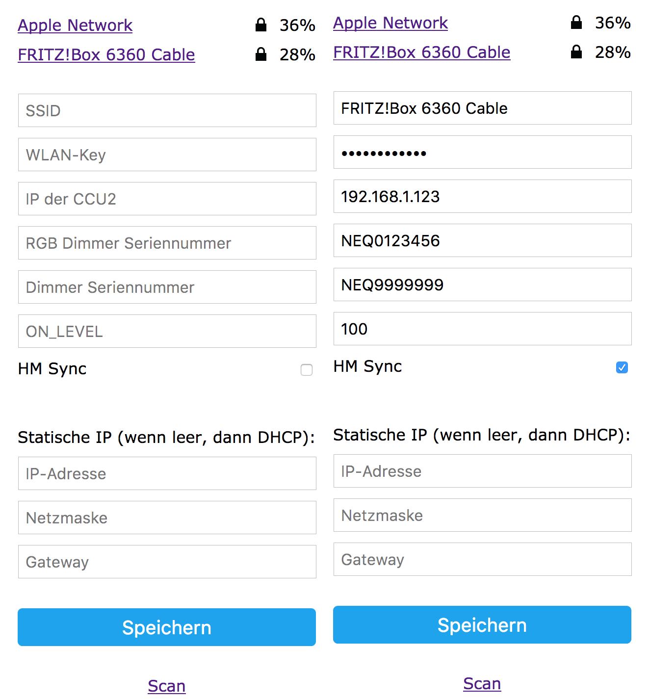

# WemosD1_HomeMatic_RGBTouch
TFT/Touchscreen-Fernbedienung für HomeMatic RGB Controller und/oder UP-Dimmer 

Wiring: [Link](http://usemodj.com/2016/03/21/esp8266-display-2-8-inch-touch-lcd-with-wemos-d1-mini-board/) 
Config (Start device keeping touchscreen touched):

